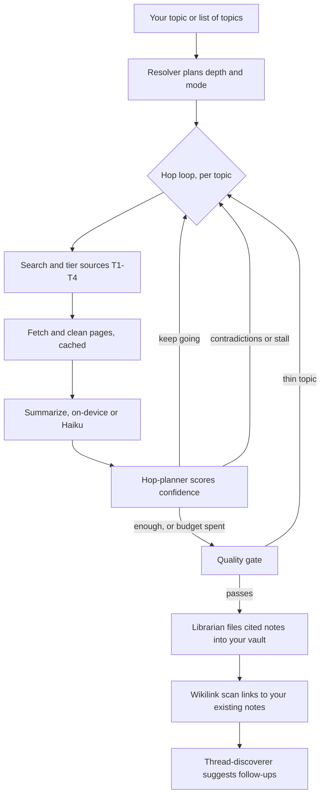

# Researcher

    

Researcher is a Claude Code plugin that does real web research for you and files the results away as finished notes. Hand it one topic or a list of fifty, and a few minutes later your Obsidian vault has a handful of new notes waiting. Each one is searched, weighed for source quality, and cross-linked, then written to match how you already organize things: frontmatter, tags, `[[wikilinks]]`, and a sources section at the bottom.

It runs on Claude Code's own subagents (or a local model on your machine), so there's no separate API key to wire up and no per-search bill to watch.

## How it works



## What you can do with it

- **Ask about anything.** `/researcher "the history of license plate readers in South Carolina"` and it comes back with a small, linked set of notes instead of 14 open browser tabs.
- **Hand it a whole list.** Point it at a file of topics and it works through all of them, not just the first few.
- **Run big batches in parallel.** Got 30 or 50 topics? Researcher fans them out and researches them at the same time instead of one after another, then writes them all into your vault. (This is the newest piece, built for people doing real volume.)
- **Let it find the next thread.** After a batch, it reads back over what it just wrote, spots the loose ends worth chasing, and offers to research those too.
- **Keep everything in one place.** New notes link to the notes you already have and live in your vault, not in a separate app.

## What makes it useful

It checks its sources. Every source gets a credibility rating, and a peer-reviewed paper or an official dataset counts for more than a random blog. The research keeps going until it has enough solid material or hits a sensible stopping point, so you're not reading notes built on one shaky link.

For anything ambiguous or big, it shows you the plan first: what it's about to do, and roughly what it'll cost in time and tokens. Then you say go.

It costs nothing on top of what you already pay for Claude. The work happens through Claude Code, with an optional local model (Ollama) doing the summarizing if you have one.

## Quick start

Install it from the Fieldwork marketplace:

```
/plugin marketplace add TimSimpsonJr/fieldwork-plugins
/plugin install researcher@fieldwork
```

Point it at your vault once:

```
/researcher-setup
```

Then research anything:

```
/researcher "any topic"
```

The setup wizard walks you through it step by step and never changes anything without asking first.

## The three ways to run it

- **One topic.** `/researcher "quantum computing"` researches a single topic start to finish.
- **A batch.** `/researcher batch topics.md` works through a list of topics from a file. Past about 10 topics, it automatically switches to the parallel batch engine.
- **Thread-pull.** After a batch, it suggests follow-up topics it found in your new notes, and you pick which ones to chase.

---

## Under the hood

The mechanics behind a run.

### Depth

The planner assigns each topic a depth, which sets how hard it digs before it stops:

| Depth        | Hop limit | Confidence target | Typical use                                 |
|--------------|-----------|-------------------|---------------------------------------------|
| `quick`      | 1         | 0.6               | a fast lookup or a small clarifying question |
| `standard`   | 3         | 0.7               | most everyday topics                         |
| `deep`       | 4         | 0.8               | technical or policy work that needs primaries |
| `exhaustive` | 5         | 0.9               | research-paper-grade coverage                |

### The research loop

Each topic runs a loop: search for sources (scored by credibility), fetch and clean the pages (with a cache so it never re-downloads the same thing), summarize them, then decide what to do next. The planner either keeps going down a chosen thread, stops because it has enough, or replans when the sources contradict each other or the coverage stalls. A quality check at the end can send a thin topic back around for another pass (up to twice) before it's flagged and moved on.

### Source ratings

Every source gets a tier from T1 (peer-reviewed work, primary documents, official datasets) down to T4 (opinion columns, personal blogs, social posts), plus a separate flag for whether it's a primary source. Confidence for a topic blends four things: how varied the source tiers are, how well the topic is covered, whether primary sources showed up, and whether there are enough sources overall. A second signal watches for contradictions and can trigger a replan on its own.

### Where notes go

Researcher hands the write-up to its companion plugin, [Librarian](https://github.com/TimSimpsonJr/librarian), which turns the research into proper vault notes: classified into the right folders, tagged, wikilinked to what you already have, with map-of-content pages kept up to date. (Librarian installs automatically alongside Researcher.)

### What it needs

Researcher runs on three tiers, and figures out which one you're on automatically:

| Tier     | You have                                            | You get                                                              |
|----------|-----------------------------------------------------|---------------------------------------------------------------------|
| **Base** | Claude Code (that's it)                             | The full pipeline, all through subagents                            |
| **Mid**  | Base, plus [Ollama](https://ollama.com)             | Summarizing happens on your machine                                 |
| **Full** | Mid, plus SearXNG, Playwright, yt-dlp, Whisper      | Private search, JavaScript-heavy pages, YouTube and audio transcription |

`/researcher-setup` checks what you have and can start the optional pieces for you.

### Project layout

See [MANIFEST.md](MANIFEST.md) for the full file tree and how the pieces fit together.

> [!NOTE]
> **What you need:** Python 3.12, [Claude Code](https://docs.anthropic.com/en/docs/claude-code), and an [Obsidian](https://obsidian.md/) vault. That's the whole base tier. Claude installs the optional Python pieces for you. The heavier extras (mise/Node, Docker for SearXNG) are only for the full tier and for contributors.

> [!IMPORTANT]
> **Your data & privacy:** Your finished notes and your vault stay on your machine, and there's no separate Researcher service collecting anything. On the base tier, the web research runs through Claude Code's own search and page-fetching, so your queries and the source URLs are handled the same way as any Claude Code web task. Fetched pages are cached locally so the same URL is never pulled twice. On the mid and full tiers, more of the work moves on-device: summarizing runs locally through Ollama, and search can route through your own private SearXNG instance, so even the queries stay on your network. There's no built-in PII redaction here; for redaction and chain-of-custody on sensitive documents, that's [Magpie](https://github.com/TimSimpsonJr/magpie)'s job in the same suite.

## For developers

```bash
pip install -r requirements.txt
pip install pytest pytest-mock
pytest tests/ -v
```

The Python suite is 389 tests, all offline, no API key needed. The batch workflow's JavaScript helpers have their own `node --test` suite (run `node --test` from the repo root).

**Requirements:** Python 3.12, [Claude Code](https://docs.anthropic.com/en/docs/claude-code), and an [Obsidian](https://obsidian.md/) vault.

**Optional (full tier):** Docker (for SearXNG), Ollama, Playwright, `yt-dlp`, `openai-whisper`.

## Part of the Fieldwork suite
- [Researcher](https://github.com/TimSimpsonJr/researcher): gather sources into cited notes
- [Magpie](https://github.com/TimSimpsonJr/magpie): analyze FOIA/data into findings
- [Librarian](https://github.com/TimSimpsonJr/librarian): file findings as linked notes (shared layer)
- [Copydesk](https://github.com/TimSimpsonJr/copydesk): write findings up in your voice

## License

MIT
